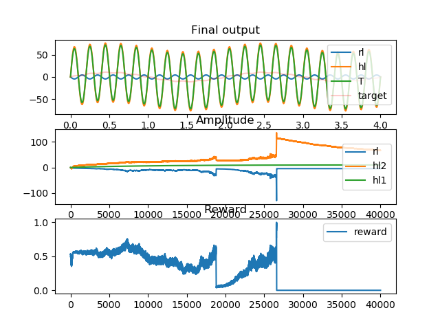
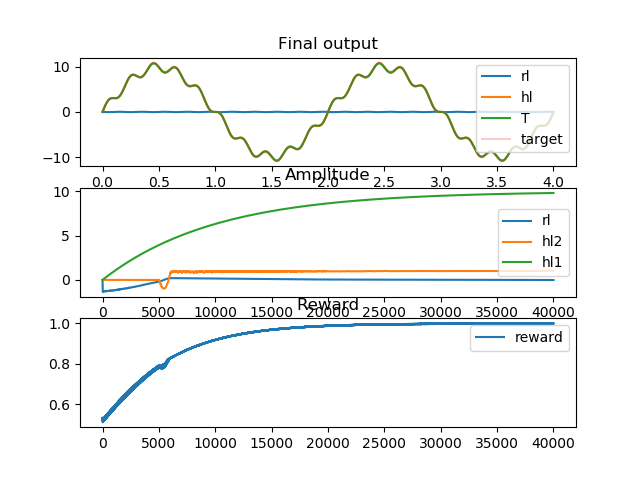
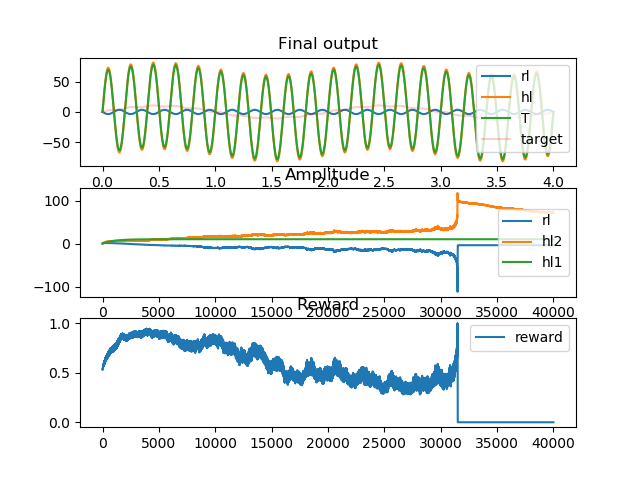
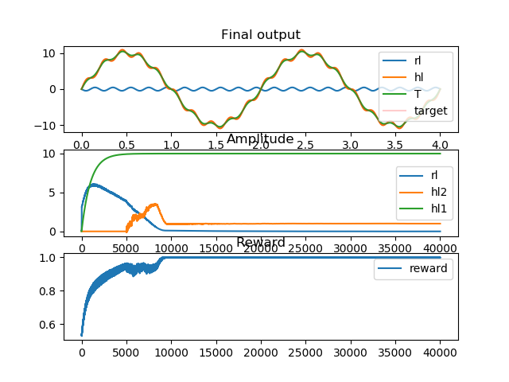
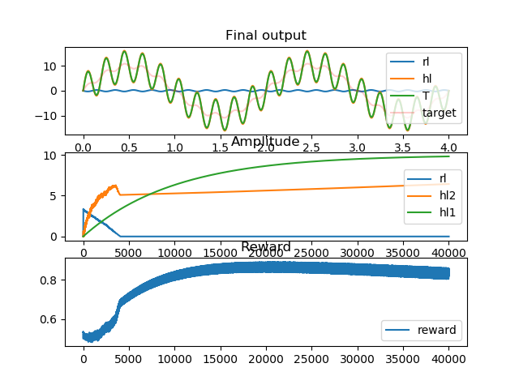
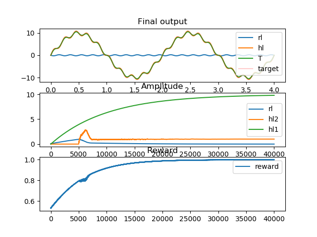
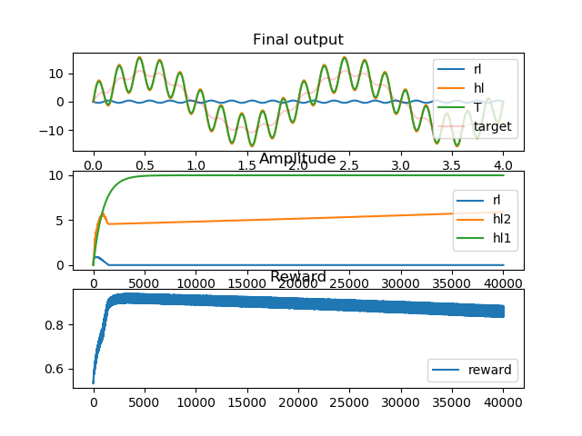
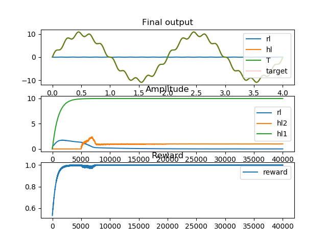

## Review Illustration

Taking inspiration from the songbird literature, we see that a primary cortical pathway is responsible for producing song. However, learning a song, similar to the tutor song, is assisted by a secondary BG-thalamocortical pathway. Meanwhile, the primary pathway sprouts more new synaptic connections.

We illustrate this concept here, in simpler terms.  
Instead of a song, we use a combination of 2 sine waves, of different frequencies, as a target.
We use simplified, unrealistic means to represent the 2 pathways.

The system has 2 pathways:-  

- Pathway 1: Primary cortical pathway, producing song.
This uses the output of pathway 2 as a tutor signal, and tries to mimic it.
- Pathway 2: Secondary BG-thalamocortical pathway, providing a tutor signal.
This processes the output of the system, and evaluates the reward obtained. Here, we use reinforcement learning.

Pathway 1 and 2 are responsible for accurately reaching the desired amplitude of the sine wave of the faster frequency.

```
Target			=	10 * sin(t) + 1 * sin(10t)
Pathway 1		=	hl1 * sin(t) + hl2 * sin(10t)
Pathway 2		=	rl * sin(10t)
Output			=	Pathway 1 + Pathway 2
```

Meanwhile, independently, the amplitude of the slower sine wave grows automatically (not modelled here).

In the results, you can see that:-  

- Pathway 2 initially explores, and after having coached pathway 1, it's activity reduces to zero.
- Pathway 1 follows pathway 2, and eventually produces the correct output.
- However, this happens more robustly, when there's a delay in the development of pathway 1.
- When pathway 1 and 2 are updated simulataneously, from the very beginning, it tends to disrupt the learning, and sometimes never converges.


### Results

Below are some cherry picked results, representing the majority of simulations.

It shows that when pathway 1 starts developing after the initial exploration of pathway 2, the target is better learnt.  
Simulataneous development tends to pathway 1 learning incorrect values from a premature tutor signal.

1. Slow sprouting; Negative values allowed



2. Fast sprouting; Negative values allowed



3. Slow sprouting; Negative values not allowed



4. Fast sprouting; Negative values not allowed


